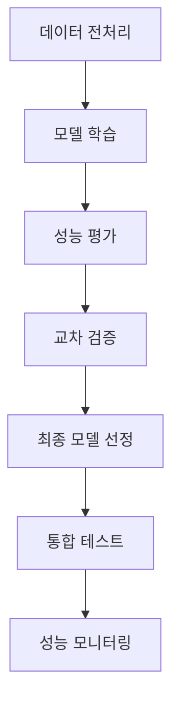
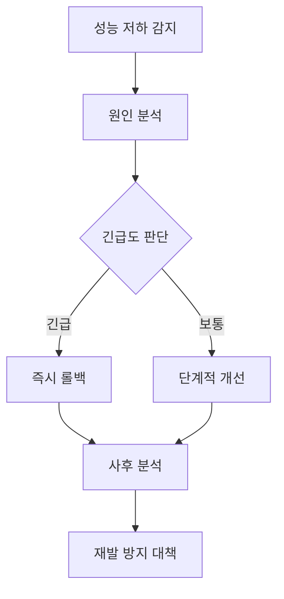

# 보이스피싱 판단 AI 모델 평가지표서

## 문서 정보

| 항목 | 내용 |
|------|------|
| 문서명 | 모델 평가지표서 |
| 작성자 | 우가우가조 (곽우재, 김채연, 송진주, 정영재) |
| 작성일 | 2025.07.10 |
| 버전 | v3.0 |
| 프로젝트명 | 보이스피싱 판단 AI 모델 개발 및 외부 시스템 활용을 위한 API 개발 |

## 1. 문서 개요

본 문서는 보이스피싱 탐지 시스템의 AI 모델들에 대한 종합적인 평가 지표와 성능 기준을 정의합니다. 4단계 AI 파이프라인(STT → ML → DL → LLM)을 통한 보이스피싱 탐지 시스템의 각 단계별 모델 성능을 객관적으로 평가하고 최적화하는 것을 목적으로 합니다.

## 2. 목적 및 적용 범위

### 2.1 목적

본 문서는 보이스피싱 판별 시스템의 각 모델별 성능을 정량적이고 객관적인 지표로 평가하고, 그 결과를 바탕으로 최적의 모델을 선정하며 향후 개선 방향을 도출하는 것을 목적으로 합니다.

### 2.2 평가 범위

| 기능 코드 | 설명 | 평가 대상 |
|-----------|------|----------|
| FC-02 | 1차 키워드 기반 분류 | ML 모델의 성능 검증 |
| FC-03 | 2차 맥락 기반 분류 | DL 모델 (KoBERT, LSTM)의 성능 검증 |
| FC-04 | LLM 기반 경고 메시지 생성 | KoBART/GPT-4o 기반 메시지 생성 및 기준 정의 |

## 3. 평가 데이터셋

### 3.1 데이터셋 개요

| 항목 | 내용 |
|------|------|
| 출처 | 금융감독원, 유튜브, GitHub, 뉴스, 논문, LLM(GPT-4o) |
| 라벨링 기준 | 기본: is_phishing, 심화: phishing_type |
| 분할 비율 | Training 80% / Validation 10% / Test 10% |
| 권장 샘플 수 | ≥ 10,000건 |
| 지원 파일 형식 | WAV, MP3, M4A, AMR (≤30MB, ≤60분) |
| STT 방식 | VITO STT API |
| 품질 기준 | 라벨링 정확도 100%, 필수 항목 누락율 ≤ 5% |

### 3.2 데이터 품질 기준

| 기준 항목 | 목표 값 | 검증 방법 |
|----------|--------|----------|
| 라벨링 정확도 | 100% | 전문가 검토 및 교차 검증 |
| 필수 항목 누락율 | ≤ 5% | 자동 검증 스크립트 |
| 데이터 중복률 | ≤ 1% | Hash 기반 중복 검사 |
| 텍스트 품질 | 95% 이상 | STT 신뢰도 스코어 기준 |

## 4. 평가 대상 모델

### 4.1 주요 모델

| 구분 | 모델명 | 사용 목적 | 적용 방식 | 개발 일정 |
|------|--------|----------|----------|----------|
| 1차 탐지 | keyword_ML_v1 | 1차 키워드 기반 신속 탐지 | TF-IDF + SVM (빈도 비교) | 2025.07.21~07.27 |
| 2차 탐지 | context_DL_v1 | 2차 문맥 기반 정밀 판별 | KoBERT + Classifier | 2025.07.21~07.27 |
| 통합 | 연동 모델 | 1차+2차 순차 처리 시스템 | ML→DL 파이프라인 | 모델 개발 후 |

### 4.2 비교 모델 (벤치마크)

| 구분 | 모델명 | 사용 목적 | 적용 방식 |
|------|--------|----------|----------|
| 비교용 | LightGBM_v1 | 속도 중심 경량 모델 | Feature Engineering + LightGBM |
| 비교용 | CNN-BiLSTM_v1 | 하이브리드 딥러닝 모델 | CNN + Bi-LSTM + Attention |
| 비교용 | KoELECTRA_v1 | 최신 경량화 딥러닝 모델 | KoELECTRA + Classifier |

## 5. 주요 평가 지표 정의

### 5.1 분류 모델 평가 지표 (FC-02, FC-03)

| 지표명 | 정의/의미 | 수식 | 목표치 | 가중치 |
|--------|-----------|------|--------|--------|
| **Recall** | 실제 보이스피싱 중 올바르게 탐지한 비율 | TP / (TP + FN) | ≥ 95% | 40% |
| **Precision** | 보이스피싱 예측 중 실제 피싱 비율 | TP / (TP + FP) | ≥ 90% | 25% |
| **F1-Score** | Precision과 Recall의 조화 평균 | 2×(P×R)/(P+R) | ≥ 90% | 15% |
| **Accuracy** | 전체 예측 중 올바른 예측 비율 | (TP + TN) / Total | ≥ 90% | 20% |
| **PR-AUC** | Precision-Recall 곡선 아래 면적 | PR 곡선 면적 | ≥ 0.90 | - |
| **ROC-AUC** | ROC 곡선 아래 면적 | ROC 곡선 면적 | ≥ 0.95 | - |
| **Inference Time** | 단일 처리 평균 시간(ms) | 모델 추론 지연 시간 | 1차 ≤100ms; 2차 ≤800ms | - |

### 5.2 평가 지표 상세 설명

#### 5.2.1 핵심 성능 지표

**Recall (재현율, 민감도)**
- **중요도**: 가장 높음 (40% 가중치)
- **의미**: 실제 보이스피싱을 놓치지 않는 능력
- **임계값**: 95% 이상 (보이스피싱 미탐지 최소화가 핵심)

**Precision (정밀도)**
- **중요도**: 높음 (25% 가중치)
- **의미**: 피싱이라고 판단한 것 중 실제 피싱인 비율
- **임계값**: 90% 이상 (오탐지율 최소화)

#### 5.2.2 성능 균형 지표

**F1-Score**
- **중요도**: 보통 (15% 가중치)
- **의미**: Precision과 Recall의 균형점
- **임계값**: 90% 이상

**Accuracy**
- **중요도**: 보통 (20% 가중치)
- **의미**: 전체적인 분류 정확도
- **임계값**: 90% 이상

### 5.3 모델별 목표 성능 기준

| 모델군 | Accuracy | Precision | Recall | F1-Score | ROC-AUC | PR-AUC | Inference Time |
|--------|----------|-----------|--------|----------|---------|--------|----------------|
| **1차 ML** | ≥ 90% | ≥ 85% | ≥ 95% | ≥ 90% | ≥ 0.95 | ≥ 0.90 | ≤ 100ms |
| **2차 DL** | ≥ 92% | ≥ 90% | ≥ 95% | ≥ 93% | ≥ 0.96 | ≥ 0.92 | ≤ 800ms |
| **통합 시스템** | ≥ 94% | ≥ 88% | ≥ 99% | ≥ 94% | ≥ 0.98 | ≥ 0.95 | ≤ 1000ms |

## 6. 평가 절차 및 개발 일정

### 6.1 평가 단계별 일정

| 단계 | WBS 코드 | 주요 활동 | 일정 | 산출물 |
|------|-----------|----------|------|--------|
| **데이터 준비** | F-1~F-13, G-1~G-3, H-1~H-4, I-1~I-5, J-1~J-5, K-1~K-2, L-1~L-9, M-1~M-6, N-1~N-7, O-1~O-2 | 데이터 수집·전처리·EDA·품질 검사·정제·DB설계·통합 | ~2025.07.13 | 분석용 데이터셋, 데이터 생성 프롬프트, 메타데이터 사전, 데이터 품질 보고서, 설계 리뷰서, 통합 아키텍처 설계도, 통합 데이터셋 |
| **1차 모델 개발** | P-1~P-6 | ML 모델 설계·학습·성능 비교·선정 | 2025.07.21~07.27 | 모델-1 개발 결과 보고서 |
| **2차 모델 개발** | P-7~P-12 | DL 모델 설계·학습·성능 비교·선정 | 2025.07.21~07.27 | 모델-2 개발 결과 보고서 |
| **모델 통합** | Q-1~Q-3 | 모델 연동·테스트·판별 | 모델 개발 후 | 통합 모델 결과 보고서 |
| **성능 검증** | T-1~T-3 | 통합 테스트·성능·부하 테스트 | 2025.07.28~07.29 | 성능 테스트 결과 보고서 |
| **최종 보고** | Q-4, V-3, W-1 | 평가 지표서 완성·보안 점검 | 2025.07.30~08.01 | 사용자 메뉴얼 최종안, 연동 모델 결과 보고서, 최종보고서 |

### 6.2 평가 프로세스

## 7. 모델별 성능 결과

### 7.1 성능 결과 템플릿

| 모델명 | Accuracy | Precision | Recall | F1 Score | PR-AUC | ROC-AUC | Inference Time(ms) | 상태 |
|--------|----------|-----------|--------|----------|--------|---------|-------------------|------|
| keyword_ML_v1 | - | - | - | - | - | - | - | 개발 예정 |
| context_DL_v1 | - | - | - | - | - | - | - | 개발 예정 |
| LightGBM_v1 | - | - | - | - | - | - | - | 벤치마크용 |
| CNN-BiLSTM_v1 | - | - | - | - | - | - | - | 벤치마크용 |
| KoELECTRA_v1 | - | - | - | - | - | - | - | 벤치마크용 |
| 통합 시스템 | - | - | - | - | - | - | - | 개발 예정 |

### 7.2 성능 분석 기준

#### 7.2.1 합격 기준

| 등급 | 기준 | 조건 |
|------|------|------|
| **우수** | 모든 목표치 달성 + 추가 기준 충족 | Recall ≥ 98%, Precision ≥ 95% |
| **양호** | 모든 목표치 달성 | 모든 지표가 목표치 이상 |
| **보통** | 주요 지표 달성 | Recall ≥ 95%, 기타 지표 90% 이상 |
| **미흡** | 최소 기준 미달성 | Recall < 95% 또는 주요 지표 부족 |

#### 7.2.2 모델 선정 기준

1. **1차 선별**: Recall ≥ 95% (필수 조건)
2. **2차 선별**: F1-Score 및 전체적 성능 균형
3. **3차 선별**: 추론 속도 및 리소스 효율성
4. **최종 선정**: 실제 운영 환경에서의 안정성

## 8. Confusion Matrix (혼동 행렬)

### 8.1 혼동 행렬 템플릿

|           | **예측: 보이스피싱** | **예측: 정상** |
|-----------|---------------------|----------------|
| **실제: 보이스피싱** | TP ( - ) | FN ( - ) |
| **실제: 정상** | FP ( - ) | TN ( - ) |

### 8.2 혼동 행렬 분석 기준

| 지표 | 계산식 | 목표값 | 중요도 |
|------|--------|--------|--------|
| **True Positive Rate** | TP / (TP + FN) | ≥ 95% | 최고 |
| **False Positive Rate** | FP / (FP + TN) | ≤ 10% | 높음 |
| **False Negative Rate** | FN / (TP + FN) | ≤ 5% | 최고 |
| **True Negative Rate** | TN / (FP + TN) | ≥ 90% | 보통 |

### 8.3 오류 분석 계획

| 오류 유형 | 분석 방법 | 개선 방안 |
|----------|-----------|----------|
| **False Positive** | 오탐지 사례 분석 | 키워드 필터링 강화, 문맥 이해 개선 |
| **False Negative** | 미탐지 사례 분석 | 새로운 피싱 패턴 학습, 모델 앙상블 |
| **경계 사례** | 낮은 신뢰도 예측 분석 | 추가 특성 추출, 임계값 조정 |

## 9. 평가 환경 및 인프라

### 9.1 실행 환경

| 항목 | 사양 또는 조건 |
|------|----------------|
| **클라우드 환경** | Google Colab (GPU), runpod (GPU) |
| **주요 프레임워크** | PyTorch 2.0, Transformers, scikit-learn, Django |
| **운영체제** | Windows 10 / Python 3.10 |
| **STT 연동** | VITO STT API (화자 분리, 한국어 특화) |
| **LLM 연동** | OpenAI GPT-4o API |
| **재현성 보장** | torch.manual_seed(77), random.seed(77) 고정 |
| **보안** | TLS 전 구간 적용, 개인정보 익명화 |

### 9.2 하드웨어 요구사항

| 구분 | 최소 사양 | 권장 사양 | 목적 |
|------|----------|----------|------|
| **GPU** | GTX 1080 8GB | RTX 4090 24GB | 딥러닝 모델 학습/추론 |
| **CPU** | Intel i5-8400 | Intel i7-12700K | 전처리 및 ML 모델 |
| **RAM** | 16GB | 32GB | 대용량 데이터 처리 |
| **Storage** | SSD 100GB | SSD 500GB | 데이터셋 및 모델 저장 |

### 9.3 성능 모니터링

| 지표 | 모니터링 방식 | 목표 기준 | 알림 조건 |
|------|---------------|----------|----------|
| **처리량** | 초당 처리 건수 추적 | ≥ 10건/초 (NFC-01 준수) | < 8건/초 |
| **응답시간** | API 레이턴시 측정 | STT ≤1초; GPT-4o ≤0.8초; ML/DL ≤1초 | 목표치 초과 시 |
| **일일 처리량** | 일일 총 분석 건수 추적 | ≥ 1,000건 | < 800건 |
| **시스템 가용성** | 시스템 가동 시간 모니터링 | ≥ 99.9% (NFC-03 준수) | < 99.5% |

### 9.4 모니터링 대시보드

#### 9.4.1 실시간 지표

- **API 응답시간** (실시간 차트)
- **에러율** (시간별 추이)
- **처리량** (분당/시간당)
- **시스템 리소스** (CPU, GPU, Memory 사용률)

#### 9.4.2 일간/주간 리포트

- **성능 트렌드 분석**
- **오류 패턴 분석**
- **사용자 피드백 통계**
- **모델 정확도 변화 추이**

## 10. 품질 보증 및 테스트 계획

### 10.1 테스트 유형

| 테스트 유형 | 목적 | 방법 | 기준 |
|-------------|------|------|------|
| **단위 테스트** | 개별 모델 검증 | 자동화된 테스트 케이스 | 모든 테스트 통과 |
| **통합 테스트** | 파이프라인 검증 | End-to-End 테스트 | 전체 플로우 정상 동작 |
| **성능 테스트** | 처리량 및 응답시간 | 부하 테스트 도구 | 목표 성능 달성 |
| **스트레스 테스트** | 시스템 한계 측정 | 점진적 부하 증가 | 안정성 임계점 파악 |

### 10.2 A/B 테스트 계획

| 구분 | A 그룹 | B 그룹 | 측정 지표 | 기간 |
|------|--------|--------|----------|------|
| **모델 비교** | 기존 모델 | 신규 모델 | 정확도, 처리시간 | 2주 |
| **임계값 조정** | 기본 임계값 | 조정된 임계값 | Precision/Recall 균형 | 1주 |
| **UI/UX 개선** | 기존 인터페이스 | 개선된 인터페이스 | 사용자 만족도 | 2주 |

## 11. 위험 관리 및 대응 계획

### 11.1 위험 요소 및 대응 방안

| 위험 요소 | 발생 확률 | 영향도 | 대응 방안 | 담당자 |
|----------|-----------|--------|----------|--------|
| **모델 성능 저하** | 중간 | 높음 | 백업 모델 준비, 롤백 계획 | 모델 개발팀 |
| **데이터 품질 문제** | 낮음 | 높음 | 데이터 검증 자동화, 품질 모니터링 | 데이터팀 |
| **API 장애** | 낮음 | 중간 | 다중화 구성, 장애 조치 매뉴얼 | 인프라팀 |
| **보안 이슈** | 낮음 | 높음 | 보안 감사, 취약점 점검 | 보안팀 |

### 11.2 성능 저하 대응 절차

## 12. 결론 및 향후 계획

### 12.1 평가 지표의 중요도

1. **보이스피싱 탐지율** (Recall): 최우선 목표
2. **사용자 경험**: 빠른 응답시간과 정확한 결과
3. **시스템 안정성**: 지속적인 서비스 제공
4. **확장성**: 향후 기능 추가 대비

### 12.2 지속적 개선 계획

- **월간 모델 성능 리뷰**
- **새로운 피싱 패턴 학습**
- **사용자 피드백 반영**
- **기술 트렌드 모니터링**

### 12.3 성공 기준

본 프로젝트의 성공은 다음 기준으로 평가됩니다:

1. **기술적 성공**: 모든 모델이 목표 성능 달성
2. **사업적 성공**: 실제 보이스피싱 탐지율 향상
3. **사용자 만족**: 시스템 사용성 및 신뢰도 확보